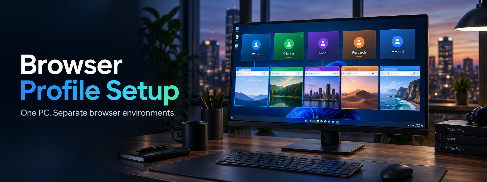

# Browser Profile Setup



[简体中文](./README.md) | 日本語

Microsoft Edge または Google Chrome 用に独立したブラウザープロファイルを作成し、対応するデスクトップショートカットを生成する Windows 向けツールです。

複数の店舗、業務アカウント、テスト環境などを、それぞれ異なる Cookie、ログイン状態、ブラウザー設定で管理できます。

## 主な機能

- Microsoft Edge と Google Chrome に対応
- インストール済みブラウザーを自動検出
- Windows のユーザー優先言語に基づいて中国語または日本語を自動表示
- アカウントごとに独立したユーザーデータフォルダーを作成
- 専用のデスクトップショートカットを自動生成
- 同名ショートカットを上書きする前に確認
- 複数のアカウント環境を続けて作成可能

## 動作環境

- Windows 10 または Windows 11
- Windows PowerShell 5.1 以降
- Microsoft Edge または Google Chrome

追加の依存関係やビルド作業は必要ありません。

## 使用方法

1. `Start.bat` をダブルクリックします。
2. 使用するブラウザーを選択します。
3. アカウント名（例：`店舗A`）を入力します。
4. 作成した環境をすぐに起動するか選択します。
5. 次回以降はデスクトップに作成されたショートカットを使用します。

PowerShell から直接起動することもできます。

```powershell
powershell.exe -NoProfile -ExecutionPolicy Bypass -File .\BrowserProfileSetup.ps1
```

Windows のユーザー言語一覧の先頭項目が日本語の場合は日本語、それ以外の場合は中国語で表示されます。

## 保存先

ブラウザープロファイルは、選択したブラウザーに応じて次の場所に保存されます。

```text
Documents\EdgeProfiles\<アカウント名>
Documents\ChromeProfiles\<アカウント名>
```

デスクトップショートカットは次の形式で作成されます。

```text
<アカウント名> - Edge.lnk
<アカウント名> - Chrome.lnk
```

アカウント名には、Windows のファイル名に使用できない文字、先頭または末尾の空白、末尾のピリオド、`CON`、`PRN`、`AUX`、`NUL`、`COM1`～`COM9`、`LPT1`～`LPT9` などのシステム予約名を使用できません。要件を満たさない場合は、再入力を求められます。

## 注意事項

- プロファイルフォルダーには Cookie、ログイン情報、ブラウザー設定が保存される場合があります。共有したり、公開リポジトリへコミットしたりしないでください。
- プロファイルフォルダーを削除すると、その環境に保存されたブラウザーデータも削除されます。
- デスクトップショートカットだけを削除しても、`Documents` 内のプロファイルデータは削除されません。
- 会社や組織が管理する端末では、PowerShell またはブラウザーの起動引数がセキュリティポリシーで制限される場合があります。

## ファイル構成

```text
BrowserProfileSetup.ps1  # メインスクリプト
Start.bat                # ダブルクリック用ランチャー
locales\zh-CN.psd1       # 簡体字中国語の表示テキスト
locales\ja-JP.psd1       # 日本語の表示テキスト
assets\browser-profile-setup-banner.png  # README プロジェクトバナー
AGENTS.md                # コントリビューターおよびエージェント向けガイド
README.md                # 中国語版プロジェクト説明
README.ja.md             # 日本語版プロジェクト説明
```

## 開発時の確認

変更後は PowerShell の構文を確認し、テスト用アカウントで Edge と Chrome の両方を手動検証してください。詳細なルールは中国語版の [`AGENTS.md`](./AGENTS.md) を参照してください。
